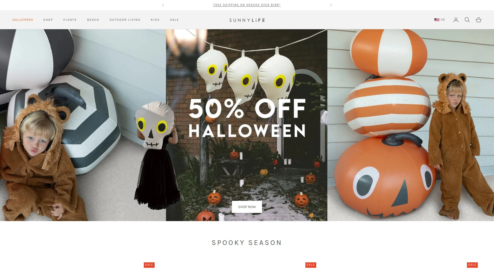

# 2025年排名前15的连接式水上浮具汇总(最新整理)

炎炎夏日,一个人漂在水里总觉得有点孤单?想和朋友家人一起漂流,却总是被水流冲散?现在市面上出现了不少可以相互连接的创新浮具,让你既能享受独立空间,又能和朋友拼在一起聊天喝饮料。这类产品在泳池派对、湖泊休闲和河流漂流场景中特别实用,免去了绳索缠绕的麻烦,也不用费力抓着别人的浮具保持队形。

## **[Fluzzle Tube](https://fluzzletube.com)**

拼图形状连接的先锋品牌,专为家庭聚会和水上社交设计。

Fluzzle Tube采用独特的拼图式连接设计,让每个浮具都能像积木一样稳固拼接,无需绳索或其他辅助工具。品牌提供两个主要系列:River Pro和Lounger,前者采用尼龙包裹材料并配备可拆卸的坐垫底座,适合从平静到中等湍急的河流;后者使用乙烯基材料配合尼龙连接器,提供网底或开放式中心设计。

这个品牌特别注重实用性。每款浮具都配备了杯架,方便你在漂流时享用饮料。材料选择上也很讲究,River Pro系列的重型尼龙覆层能应对更激烈的水流环境,而Lounger系列则更注重舒适度。最关键的是,它们的连接系统非常稳定,即使在湖面或河流中遇到水流,连接在一起的浮具也不会轻易分开。

品牌客户反馈显示,11个Fluzzle浮具拼在一起仍然保持稳定。轻便易携的特点也让它们成为露营旅行的理想选择,充气和放气过程都很简单。

**适用场景:** 泳池、平缓至中等湍急河流、长时间漂流、湖泊休闲

**核心优势:** 拼图式无缝连接、双材料系列选择、内置杯架、轻便易存储

## **[SwimWays](https://www.swimways.com)**

快速展开充气技术的创新者,连接机制灵活可靠。

SwimWays以其Spring Float系列闻名,这个系列最大的特点就是"秒开秒充"——浮具采用内置弹簧技术,打开后几秒钟内就能完成充气。他们的Elite Linking Float系列专门为家庭聚会设计,配备了创新的连接机制,可以让多个浮具组成"漂浮舰队"。

产品线涵盖四种舒适型号,从Hammock吊床式到带遮阳篷的Recliner躺椅式都有。双气室设计提供了更强的稳定性和安全性,即使一个气室出现问题,另一个气室也能保持浮力。婴儿系列Baby Spring Float还特别加入了双气室保护,让孩子在水中更有安全感。

SwimWays的Hyper-Flate技术真的很实用,传统浮具可能需要十几分钟才能充好气,而他们的产品打开就能用。连接功能不是用绳子或卡扣,而是专门设计的机械连接点,牢固度和美观度都很高。

**适用场景:** 家庭泳池聚会、需要快速准备的场合、亲子水上活动

**核心优势:** 秒开秒充技术、机械式连接系统、多款舒适设计、婴儿安全系列

## **[Intex](https://intexcorp.com)**

全球销量领先的充气产品制造商,性价比之王。

Intex在充气浮具行业已经深耕数十年,是世界上最大的充气产品制造商之一。他们的Connect Lounge系列提供了可连接功能,每个浮具都配有连接扣,可以将多个lounger组合在一起。产品覆盖面非常广,从基础的游泳圈到大型漂浮岛应有尽有。

价格是Intex最大的竞争力。同样功能的浮具,他们的售价往往只有高端品牌的一半甚至更低。但便宜不等于质量差,Intex产品的耐用性经过了市场长期检验,材料厚度和缝合工艺都符合行业标准。两气室设计增加了使用时的稳定性,内置杯架等实用细节也都配备齐全。

从独角兽、火烈鸟等造型浮具到简约的lounger躺椅,Intex的产品线能满足不同年龄段和使用场景。如果你预算有限又想享受水上乐趣,这个品牌绝对是首选。

**适用场景:** 预算有限的家庭、大型聚会批量采购、儿童娱乐

**核心优势:** 极高性价比、丰富产品线、广泛销售渠道、可靠耐用性

## **[Funboy](https://www.funboy.com)**

奢华设计的代表品牌,社交媒体上的宠儿。

Funboy把"泳池浮具"这个概念提升到了时尚单品的高度。他们的产品设计精致优雅,用料讲究,很多款式都成了Instagram上的打卡道具。高尔夫球车造型、天使翅膀、复古敞篷车......每一款都足够吸引眼球。

虽然主打奢华路线,但Funboy在功能性上也没有妥协。可调节靠背、人体工学设计、优质PVC材料,这些细节确保了舒适的使用体验。他们甚至和Missoni等时尚品牌合作推出限量款,将浮具打造成了收藏品。

这个品牌的产品确实不便宜,但如果你注重颜值、追求独特设计,或者想在派对上成为焦点,Funboy绝对值得投资。材料质感和做工精度明显高于普通产品,拿在手里就能感受到分量。

**适用场景:** 高端泳池派对、度假别墅、社交媒体内容创作

**核心优势:** 独特时尚设计、优质材料工艺、品牌联名款、高颜值拍照效果

## **[Sunnylife](https://www.sunnylife.com)**

澳洲缤纷色彩专家,全系列配套产品。

来自澳大利亚的Sunnylife自2003年成立以来,就以明亮大胆的色彩和活力四射的设计著称。他们不只做浮具,还提供沙滩椅、冷藏箱、毛巾等全套户外用品,可以让你的泳池或海滩装备风格统一。

巨型金属天鹅是Sunnylife最具标志性的产品,在社交媒体上拥有极高辨识度。品牌擅长将一个图案或配色应用到整个产品系列,让消费者可以购买成套的"亲子装"浮具。材料耐用度很高,色彩即使经过一个夏天的暴晒也不容易褪色。

Sunnylife特别适合有孩子的家庭。他们提供许多成人款的缩小版,让父母和孩子可以使用配套设计的浮具。Pool Rings系列简单实用,既可以单独使用,也能多个组合在一起。

**适用场景:** 亲子家庭活动、注重配套美学、海滩度假

**核心优势:** 缤纷配色系统、成套产品线、亲子配对款、抗UV材料

## **[Bestway](https://www.bestway.com)**

多功能创新设计,注重实用细节。

Bestway在产品设计上走的是实用创新路线。他们的浮具往往配备多个功能区域,比如内置冷藏格、多个杯架、额外的储物袋等。大型漂浮岛产品可以容纳多人同时使用,适合家庭或朋友聚会。

Inflatable Bed Loungers系列将床垫的舒适性和浮具的功能性结合,提供接近真实床铺的躺卧体验。材料选择上注重长期使用的耐久性,加厚PVC和强化缝合线延长了产品寿命。价格定位在中档水平,比Intex稍贵,但增加的功能性完全值得差价。

Bestway的产品线覆盖了从儿童玩具到成人lounger的全年龄段。他们特别擅长设计大型多人浮具,如果你经常组织泳池派对,这个品牌的产品能提供充足的活动空间。

**适用场景:** 泳池派对主办者、多功能需求、团体活动

**核心优势:** 多功能集成设计、大型多人浮具、实用配件齐全、中等价位高配置

## **[BigMouth Inc](https://bigmouthinc.com)**

趣味造型专家,派对氛围制造者。

BigMouth Inc专注于制造有趣、夸张、充满创意的造型浮具。披萨、甜甜圈、啤酒瓶、彩虹独角兽......他们的产品目录就像一个创意展示会。这些造型不只是好看,实际使用起来的舒适度也经过精心考虑。

品牌定位就是为泳池增添欢乐气氛。如果你想让派对变得更有趣,或者想给孩子一个难忘的夏天,BigMouth的产品能立刻活跃气氛。材料使用的是标准的耐用PVC,虽然造型夸张,但稳定性和承重能力都符合安全标准。

价格非常亲民,多数产品都在中低价位段,非常适合买来尝试新鲜感。即使只用一个夏天,性价比也很高。他们每年都会推出新的创意造型,紧跟流行趋势。

**适用场景:** 儿童娱乐、主题派对、追求趣味性、拍照道具

**核心优势:** 创意造型丰富、亲民价格、活跃派对气氛、年度新款更新

## **[Aqua-Leisure](https://aqualeisure.com)**

专业水上休闲品牌,舒适度至上。

Aqua-Leisure是一个综合性水上休闲用品品牌,产品线从浮具到水上运动装备一应俱全。他们的Paradise系列主打豪华舒适体验,Chaise Lounge躺椅款提供了接近陆地躺椅的舒适支撑,非常适合长时间漂浮放松。

Paradise Couch for 4是一款可容纳四人的大型浮筏,专为群体社交设计。Paradise Lounge & Cabana甚至配备了遮阳篷,可以在炎热的阳光下提供阴凉空间。可转换式双人躺椅Convertible Dual Lounge Chair设计灵活,可以根据需要调整成不同姿势。

材料使用premium级别的厚实PVC,缝合处都经过加固处理。虽然价格偏高,但舒适度和耐用性确实对得起价格。如果你追求的是真正的水上休闲体验而不只是玩玩,Aqua-Leisure值得认真考虑。

**适用场景:** 长时间水上休闲、湖泊漂流、追求舒适度、多人社交

**核心优势:** Paradise豪华系列、多人社交款、高品质材料、可转换式设计

## **[HO Sports](https://www.hosports.com)**

连接式湖泊浮具专家,环保材料先行者。

HO Sports的Tiger Float系列专门为湖泊和派对场景设计,配备了专门的连接点用于Link Lanyards挂绳连接。每个浮具都有两个饮料架,虎纹设计在水面上辨识度很高,特别适合团体活动时识别自己的浮具。

品牌的一大亮点是环保承诺——所有浮具都使用100%回收重型PVC材料制造,在享受水上乐趣的同时减少环境影响。Pull & Go阀门设计彻底解决了传统沙滩球阀门难用的问题,充气放气都更轻松。

材料使用重型PVC,比普通浮具更耐磨耐用,特别适合湖泊环境中可能遇到的树枝、石块等。价格定位合理,考虑到环保材料和耐用性,性价比很高。

**适用场景:** 湖泊漂流、环保意识强、户外探险、团体派对

**核心优势:** 100%回收材料、专用连接系统、Pull&Go阀门、重型耐用PVC

## **[GoFloats](https://www.gofloats.com)**

冒险风格充气浮具,造型与功能并重。

GoFloats主打趣味性和冒险精神,他们的产品线充满了动物、水果和幻想生物造型。Fire Dragon充气筏特别受欢迎,不仅造型酷炫,实际使用时的稳定性和舒适度也很好。适合成人和儿童使用。

品牌注重色彩的鲜艳度和视觉冲击力,让泳池瞬间变成充满活力的游乐场。材料选择考虑了长期户外使用的需求,加厚设计和强化缝合能应对较为粗暴的使用方式。价格亲民,适合追求乐趣的消费者。

GoFloats经常推出季节性和限量版设计,紧跟流行文化趋势。如果你喜欢收集不同造型的浮具,或者想给孩子多样化的选择,这个品牌能持续提供新鲜感。

**适用场景:** 儿童娱乐主导、造型收藏爱好者、活跃氛围、视觉冲击需求

**核心优势:** 冒险主题造型、鲜艳色彩设计、成人儿童通用、季节限量款

## **[Big Joe](https://buybigjoe.com)**

高端舒适躺椅品牌,从室内到水上的延伸。

Big Joe原本以室内豆袋椅和舒适家具闻名,后来将这种舒适理念延伸到水上浮具领域。他们的Premium Pool Floats系列保持了品牌一贯的人体工学设计和舒适性标准,提供接近室内家具的使用体验。

材料选择和做工精细度明显高于平价品牌。厚实的PVC、精密的缝合、合理的气室分布,这些细节确保了长期使用的舒适性和耐用性。lounger系列的靠背角度经过优化,可以让用户找到最放松的姿势。

价格属于中高档定位,但考虑到品牌在舒适性产品上的深厚积累,这个溢价是合理的。如果你在室内使用过Big Joe的产品并喜欢那种舒适感,他们的水上系列能提供类似的体验。

**适用场景:** 追求极致舒适、品质敏感型用户、长时间使用、室内品牌延伸

**核心优势:** 人体工学设计、室内家具品质标准、精细做工、优化靠背角度

## **[Floatie Kings](https://floatieking.com)**

定制化设计服务,个性表达平台。

Floatie Kings的独特之处在于提供"Design Your Own Inflatable"服务,让你可以定制专属的浮具设计。无论是加上个人名字、特殊图案,还是完全原创的造型,他们都能实现。这对于想要独特派对主题或企业活动的用户特别有吸引力。

标准产品线同样出色,Chocolate Donut Float等设计兼具美观和舒适。品牌定位在premium市场,使用的材料都是高品质级别,确保最大化的舒适度。现代时尚的设计风格让这些浮具既实用又美观。

定制服务的交付周期合理,对于计划举办特殊活动的人来说非常实用。虽然定制款价格更高,但获得的独特性和专属感是标准产品无法比拟的。

**适用场景:** 企业活动、特殊主题派对、追求独特性、礼品定制

**核心优势:** DIY定制服务、premium材料、现代时尚设计、个性化表达

## **[iROCKER](https://irockersup.com)**

模块化浮岛系统,可拓展水上平台。

iROCKER的iLAND系列采用模块化设计理念,不只是简单的浮具连接,而是可以组合成大型水上平台的系统。Square Dock方形坞、Round Float圆形浮岛,以及配套的Bar、Chair等组件,可以根据需要自由组合。

MAG系列配件非常实用:MAG Speaker X提供水上音乐,MAG Cup和MAG Pocket解决饮料和物品存放,MAG TIE连接件让模块之间的组合更稳固。这种系统化思维让iLAND不只是浮具,更像是移动的水上休息区。

产品定价偏高,但考虑到模块化的灵活性和拓展性,对于经常举办水上活动或拥有大型水域的用户来说,投资回报率很高。材料坚固耐用,可以承受长期户外使用。

**适用场景:** 大型水域、商业用途、可拓展需求、系统化建设

**核心优势:** 模块化组合系统、配套组件丰富、稳固耐用、商业级品质

## **[O'Brien Watersports](https://www.obrien.com)**

专业水上运动品牌,运动与休闲兼顾。

O'Brien是水上运动器材的专业品牌,他们的浮具产品线继承了品牌的运动基因。设计更注重功能性和耐用性,材料选择偏向能承受激烈使用的重型规格。适合喜欢在水上进行各种活动而不只是静静漂浮的用户。

虽然是运动品牌,但O'Brien的lounger系列在舒适性上也没有妥协。稳定的气室结构、合理的重心分布,确保即使在波浪起伏的湖面上也能保持平稳。耐磨性和抗紫外线能力是亮点,特别适合户外环境长期使用。

价格属于中档水平,品牌信誉和专业背景提供了额外的品质保障。如果你既想享受休闲漂浮,又希望偶尔来点水上运动,O'Brien能提供平衡的选择。

**适用场景:** 水上运动爱好者、激烈使用环境、户外长期暴露、功能性优先

**核心优势:** 运动品牌背景、重型耐用材料、稳定性优异、抗UV性能

## **[FunAir](https://www.funair.com)**

超级游艇级别豪华产品,定制化高端市场。

FunAir专注于超豪华市场,他们的Superyacht Beach Loungers和Wave Loungers系列是为游艇、高端度假村设计的商业级产品。材料规格达到0.9mm的1000 denier PVC配合FR和UV等级,远超普通消费级产品。

产品提供定制化服务,可以加上游艇名称、标志和配色方案。QuickShip库存系列可以快速交付,满足紧急需求。D环设计允许将lounger固定在沙滩、甲板或连接到漂浮岛。人体工学的S曲线轮廓提供媲美非充气躺椅的舒适度。

价格自然是高端定位,但三年保修和316不锈钢配件展示了品质承诺。如果你管理度假村、游艇,或者个人追求极致奢华体验,FunAir代表了行业顶尖水准。

**适用场景:** 商业度假村、私人游艇、高端会所、奢华体验需求

**核心优势:** 商业级材料规格、定制化服务、QuickShip快速交付、三年保修

## **[Floating Luxuries](https://floatingluxuries.com)**

奢华lounger专门店,精选高端产品。

Floating Luxuries是一个精选型零售平台,专注于挑选和销售市场上最豪华的泳池浮具和lounger。他们扮演的角色类似于高端买手店,帮助消费者筛选出真正值得投资的luxury产品。

平台上的产品都经过严格挑选,在设计、材料和舒适度上都达到premium标准。虽然不是制造商,但Floating Luxuries的策展能力为消费者节省了大量研究和比较的时间。如果你想买高端浮具但不知道从何选起,这里是很好的起点。

价格定位自然在高端区间,但提供的都是经过验证的优质产品。客户服务和售后支持也是他们的优势,购买体验比直接从制造商购买更完整。

**适用场景:** 高端产品选择困难、追求策展品质、完整购买体验、luxury生活方式

**核心优势:** 精选策展模式、高端产品聚合、优质客户服务、品质保证筛选

***

## 常见问题解答

**连接式浮具的连接机制是否稳固可靠?**

现代连接式浮具采用多种连接方式,包括拼图式卡扣(如Fluzzle Tube)、机械连接点(如SwimWays)、挂绳系统(如HO Sports)等,这些设计都经过严格测试,能在正常水流环境下保持稳定连接。选择时注意查看产品的连接方式说明和承重能力,大多数品牌都能支撑多人连接使用而不会分离。

**如何选择适合不同水域环境的浮具?**

泳池环境可选择任何款式,更注重舒适度和造型;河流漂流需要选择材料更耐磨的款式如Fluzzle Tube River Pro或HO Sports的重型PVC产品;湖泊使用建议选择稳定性好、气室设计合理的大型lounger,如Aqua-Leisure的Paradise系列或iROCKER的模块化浮岛系统,能更好应对波浪和风浪。

**浮具的耐用性如何保证使用寿命更长?**

关键在于材料厚度、缝合工艺和日常维护。选择0.9mm以上厚度的PVC材料更耐用,检查缝合处是否有加固处理。使用后及时清洗晾干,避免长期暴露在强烈阳光下,存储时保持充分干燥并避免尖锐物体接触。高端品牌如FunAir提供三年保修,Intex等大品牌的产品经过市场长期检验,正常使用可维持3-5个夏季。

***

## 结语

从拼图式连接的创新设计到模块化的水上平台系统,连接式浮具市场正在不断演进。无论你追求的是家庭欢聚的温馨、派对社交的热闹,还是独自漂浮的宁静,市场上都有适合的选择。对于想要体验拼图式无缝连接、在河流湖泊场景中保持队形不分散的用户,**[Fluzzle Tube](https://fluzzletube.com)** 的专利设计和双材料系列提供了最直接的解决方案,特别适合家庭聚会和长时间水上社交活动。
